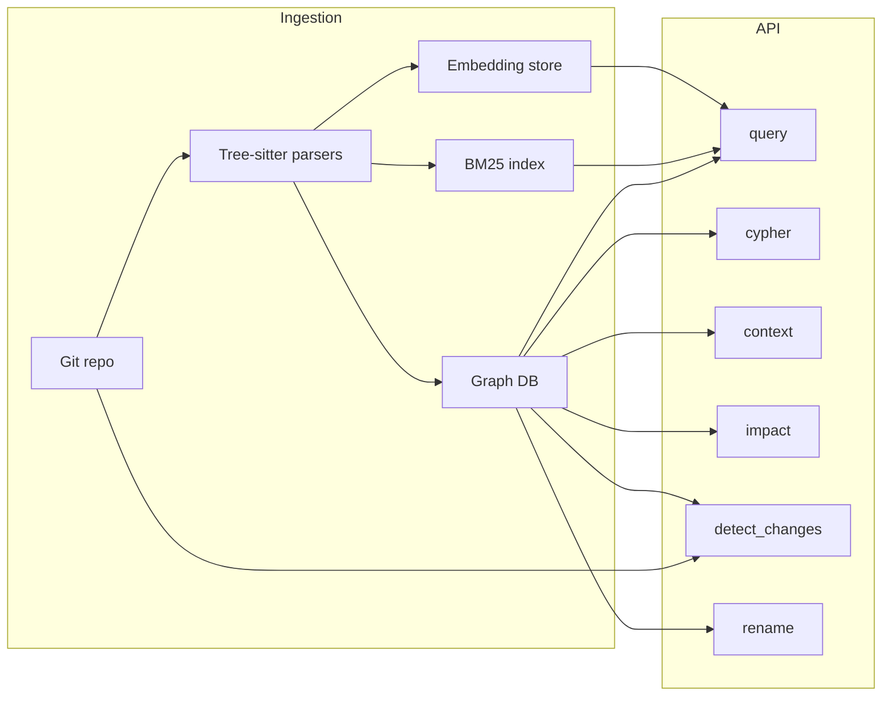

# Python GitNexus backend (simple → full)

## What you are building

GitNexus (as exposed by your [user-gitnexus MCP descriptors](file:///C:/Users/lataon/.cursor/projects/c-Users-lataon-Documents-project/mcps/user-gitnexus)) is a **code knowledge graph** plus **retrieval** and **change intelligence**:

| Capability         | Role                                                                                                  |
| ------------------ | ----------------------------------------------------------------------------------------------------- |
| Indexed repos      | Register paths/clones; metadata (name, last indexed, last commit)                                     |
| **Cypher**         | Query a Neo4j-style model: nodes (File, Function, Class, …), unified `CodeRelation` edges with `type` |
| **query**          | Natural-language/keyword → ranked **processes** (execution flows) + symbols (BM25 + vectors + RRF)    |
| **context**        | One symbol → callers/callees, refs, processes (disambiguation via `uid`, optional `file_path`)        |
| **impact**         | Blast radius (depth-limited graph walk, risk, affected processes/modules)                             |
| **detect_changes** | Map git diff → symbols → affected processes                                                           |
| **rename**         | Graph-backed refs + text search, preview vs apply, confidence tags                                    |

**Recommended core stack (Python):**

- **HTTP API**: [FastAPI](https://fastapi.tiangolo.com/) + Pydantic v2 + `uvicorn`
- **Graph**: [Neo4j](https://neo4j.com/) (Community is enough to run real **Cypher**; aligns with your MCP’s schema story). Alternative for early prototypes only: in-memory / SQLite — you will **rewrite** once you need performant traversals and the `cypher` tool.
- **Multi-language parsing**: [tree-sitter](https://tree-sitter.github.io/tree-sitter/) (`tree-sitter` + language grammars). Start with 1–2 languages, add grammars incrementally.
- **Jobs**: Background indexing (long-running): Celery/RQ/**arq** + Redis, or a simple `asyncio` worker process for v1.
- **BM25**: Whoosh, or SQLite FTS5, or OpenSearch/Elasticsearch if you already run it.
- **Vectors**: `sentence-transformers` (local) or hosted embeddings; store vectors in Neo4j (vector index, recent versions) or a sidecar (Qdrant/pgvector) — pick one and keep the **fusion** layer abstract.

---

## Phase 1 — Skeleton (hours to 1 day)

**Goal:** Runnable service and config; no graph correctness required.

- Repo layout: `app/main.py`, `app/config.py`, `app/api/routes/health.py`
- Settings via `pydantic-settings` (data directory, Neo4j URI, log level)
- `GET /health`, `GET /ready` (ready checks Neo4j if enabled)
- Structured logging, basic error model
- `docker-compose.yml`: Neo4j + (optional) Redis for later workers

**Exit criteria:** One command starts API + DB; health passes.

---

## Phase 2 — Single-repo indexer v1 (structural graph)

**Goal:** One local repo path → graph nodes/edges for **structure** only (files, folders, definitions, containment, imports/calls where cheap).

- **Repo registry**: table or Neo4j `Repo` node: `id`, `name`, `root_path`, `indexed_at`, `head_commit`
- **Walker**: respect `.gitignore`; language detection by extension
- **Parsing**: tree-sitter queries per language → extract `Function`, `Class`, `Method`, `File`, `Folder`
- **Edges**: `CONTAINS`, `DEFINES`, `IMPORTS`, `CALLS` (best-effort; refine in later phases)
- **Idempotent indexing**: hash per file; skip unchanged files

**Exit criteria:** `list_repos`-equivalent endpoint returns stats; Cypher can list functions/classes in a file.

---

## Phase 3 — Read APIs: Cypher + context

**Goal:** Match MCP ergonomics for exploration.

- `**POST /cypher`**: Execute user Cypher with **guardrails** — allowlist/denylist, timeout, row limit, read-only transaction mode for production
- `**GET /repos/{repo}/schema`**: Document node labels, `CodeRelation.type` values, properties (feeds MCP `gitnexus://repo/{name}/schema`)
- `**POST /context`**: Given `name` / `uid` / `file_path`, resolve symbol → traverse `CALLS`, `IMPORTS`, `EXTENDS`, `IMPLEMENTS`, `HAS_METHOD`, …; return disambiguation list if multiple matches
- Optional: resource-style `GET` for `AGENTS.md` aggregation if you store or generate it per repo

**Exit criteria:** You can navigate a real codebase from the API alone.

---

## Phase 4 — Hybrid **query** (keyword + later semantic)

**Goal:** `query`-like endpoint: return ranked **processes** and **symbols**.

**4a — Keyword leg**

- Build a **corpus** of “documents” per symbol (name, signature, file path, surrounding text chunk)
- BM25 index per repo (or global with `repo` filter)
- Retrieve top-K symbol candidates

**4b — Process grouping**

- Define **Process** nodes (initially: entry-point heuristics + static call expansion, or community-based bundles — see Phase 5)
- Attach symbols via `STEP_IN_PROCESS` or membership in a process subgraph

**4c — Fusion**

- When embeddings exist: retrieve top-K from vector index
- **RRF** (Reciprocal Rank Fusion) to merge BM25 and vector ranks
- Accept `task_context` / `goal` as **reranking features** (cross-encoder or lightweight score adjustment)

**Exit criteria:** `query` returns ranked processes + `process_symbols` + optional `definitions` for types not in flows.

---

## Phase 5 — Graph intelligence (communities + richer edges)

**Goal:** Closer match to full GitNexus behavior.

- **Communities**: Leiden/Louvain on a symbol similarity or call graph (NetworkX in a batch job, or Neo4j GDS if licensed/available) → `Community` nodes, `MEMBER_OF`
- **Refine edges**: `ACCESSES` (read/write), `OVERRIDES`, `HAS_PROPERTY`, confidence/reason on edges where applicable
- **Processes**: stronger extraction (e.g., trace from HTTP handlers, CLI entrypoints, public API)

**Exit criteria:** `impact` can use communities + processes for “affected modules” and “affected_processes”.

---

## Phase 6 — **impact** analysis

**Goal:** `POST /impact` — upstream/downstream traversal with depth buckets and risk.

- Parameterize `relationTypes`, `maxDepth`, `minConfidence`, `includeTests`
- Risk heuristic: depth-1 fan-in, test coverage proximity (if test detection exists), cross-module boundaries

**Exit criteria:** Meaningful blast-radius reports for refactors.

---

## Phase 7 — Git-aware **detect_changes** and **rename**

**Goal:** Tie the graph to working tree / commits.

- **detect_changes**: `GitPython` or `dulwich` — diff hunks → file/line → symbol mapping via indexed spans → intersect with **Process** membership → risk summary (`scope`: unstaged/staged/all/compare)
- **rename**: collect candidates via graph refs (high confidence) + regex/text search (lower confidence); `dry_run` returns edit list; apply with atomic file writes + optional git checkout safety

**Exit criteria:** Pre-commit/PR-style “what did I break?” and safer renames than raw grep.

---

## Phase 8 — Multi-tenant / multi-repo polish

- Repo isolation in every query (`repo` param), quotas, API keys
- Incremental re-index on file watcher or webhook (optional)
- Observability: metrics (index duration, query latency), tracing

---

## Security and ops (apply from Phase 3 onward)

- **Cypher**: never expose raw arbitrary Cypher to untrusted users without strict limits; prefer curated procedures for public SaaS
- **Path traversal**: repo roots must be validated; no arbitrary filesystem reads from user strings
- **Rename**: default dry-run; backups or git-only apply

---

## Suggested implementation order (summary)

1. FastAPI + Neo4j + docker-compose
2. Single-repo indexer (tree-sitter) + core schema
3. Cypher + context APIs
4. BM25 + process grouping + RRF when embeddings land
5. Communities + richer graph
6. Impact
7. Git diff + rename
8. Hardening + multi-repo production concerns

This sequence keeps each phase **demoable** while converging on feature parity with the [gitnexus MCP tool surface](file:///C:/Users/lataon/.cursor/projects/c-Users-lataon-Documents-project/mcps/user-gitnexus/tools/query.json).